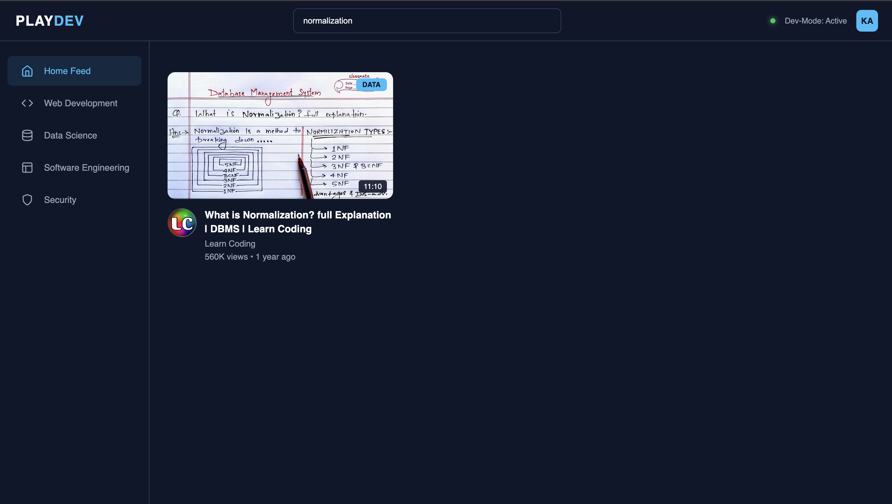

# PlayDev | Tech Content Hub

A responsive front-end media interface inspired by modern video platforms, built with a focus on clean CSS architecture, native UI/UX patterns, and vanilla interactive features.

## 🚀 Features
- **Real-Time Video Search:** A dynamic search engine that filters through the video grid instantly as you type based on video titles.
- **Sidebar Category Navigation:** Interactive filter buttons that dynamically sort the video grid by tech domains (Web Development, Data Science, Software Engineering) and manage active layout states.
- **Responsive Grid:** Uses CSS Grid and Media Queries to scale fluidly from desktop grids to single-column mobile viewports.
- **Pure CSS Tooltips:** Interactive creator-info popups built using transitions and advanced sibling selectors.
- **Glassmorphism Design:** Navigation header utilizing modern `backdrop-filter` blur effects.
- **Micro-Interactions:** Smooth hover transitions (`transform: translateY(-5px)`) across components.

## 🛠️ Tech Stack
- **HTML5:** Semantic document structure.
- **CSS3:** Custom properties (variables), Grid, Flexbox, Transitions, and Media Queries.
- **JavaScript:** Vanilla DOM manipulation, event listeners, case-insensitive string filtering, and loop-based state management.

## 📈 7-Day Sprint & Iteration Journey
- **Days 1–3 (Layout):** Structured core HTML mechanics, designed navigation panels, and built the video grid architecture using native CSS Grid and Flexbox.
- **Day 4 (Interactive UI):** Implemented native CSS state management, micro-interactions, smooth hover transitions, and a pure-CSS custom tooltip system.
- **Day 5 (Responsive Polishing):** Engineered targeted media queries to optimize column layouts, fluid typography, and sidebar adjustments for mobile device viewports.
- **Day 6 (JS Search Engine):** Built a high-performance vanilla JavaScript input tracker to filter video card elements dynamically via case-insensitive title scanning.
- **Day 7 (JS Category Filtering):** Developed a sidebar click-filtering loop that maps individual technical tags to broader domain categories and clears active state filters cleanly.

## 📸 Interface States Preview

<table width="100%">
  <tr>
    <td width="33.3%" align="center">
      <strong>1. Default Home Feed</strong>
        
      
    </td>
    <td width="33.3%" align="center">
      <strong>2. Real-Time Search Filter</strong>
        
      
    </td>
    <td width="33.3%" align="center">
      <strong>3. Sidebar Domain Sorting</strong>
        
      
    </td>
  </tr>
</table>